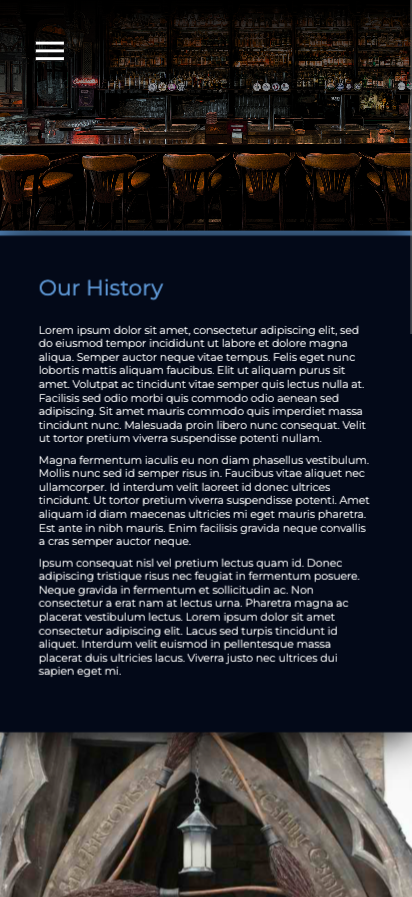
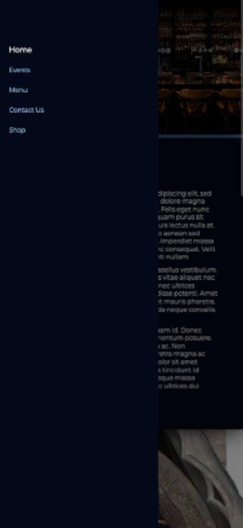

# FIT-web-dev-assignment

Web Design School Project

- [General info](#general-info)
- [Screenshots](#screenshots)
- [Technologies](#technologies)
- [Setup](#setup)
- [Features](#features)
- [Status](#status)
- [Source](#source)
- [Deployment](#deployment)
- [Other info](#other-info)
- [Contact](#contact)

## General info

This school project involves the development of a professional website tailored for The Three Broomsticks Pub, inspired by the Harry Potter theme. The focal point of this endeavor is the implementation of a responsive design, ensuring optimal functionality across various devices.

## Screenshots

 

## Technologies

- HTML5
- CSS3
- VanillaJS
- Bootstrap 5

## Features

–
–

To-do list:

–

## Status

Project is in progress

## Source

- [CSS - The Complete Guide 2021 by Academind](https://www.udemy.com/course/css-the-complete-guide-incl-flexbox-grid-sass/)

- [Carousel slider Bootstrap 5 Tutorial](https://mdbootstrap.com/docs/standard/components/carousel/)

– [W3 schools – JavaScript Tutorial](https://www.w3schools.com/js/default.asp)

– [W3 schools – CSS Tutorial](https://www.w3schools.com/css/default.asp)

## Deployment

The project is deployed on GitHub Pages. Link: https://bbkincso.github.io/FIT-web-dev-assignment/

## Other information

Images, Google fonts, etc. in the project are used strictly for studying purpose and not for comeercial use.

## Contact

Created by [bbkincso](https://www.linkedin.com/in/bbkincso)
